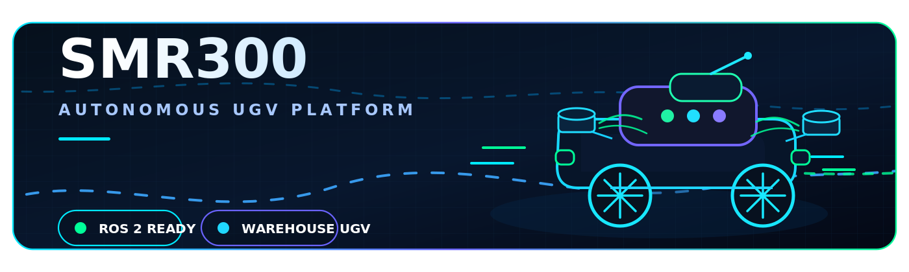
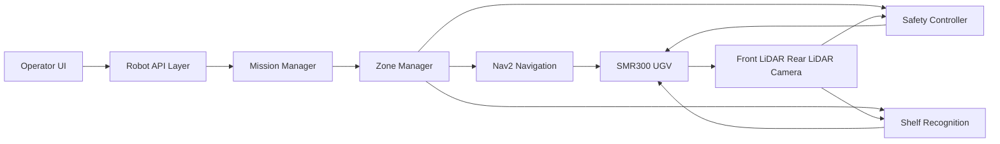

<p align="center">
  
</p>

<h1 align="center">OpenRosWarehouse</h1>

<p align="center">
  <strong>ROS 2 warehouse autonomy stack for the SMR300 UGV platform.</strong>
</p>

<p align="center">
  Operator control, mission execution, shelf recognition, path planning, safety gating and robot configuration tooling for real warehouse robot development.
</p>

<p align="center">
  <a href="https://github.com/00PrabalK00/OpenRosWarehouse/wiki"><strong>Wiki</strong></a>
  &nbsp;|&nbsp;
  <a href="https://github.com/00PrabalK00/OpenRosWarehouse/issues"><strong>Issues</strong></a>
  &nbsp;|&nbsp;
  <a href="https://github.com/00PrabalK00/OpenRosWarehouse/pulls"><strong>Pull Requests</strong></a>
</p>

## Overview

OpenRosWarehouse is a robotics software project for building, testing and documenting warehouse autonomy workflows on the SMR300 unmanned ground vehicle. The repository focuses on ROS 2 based operation, operator side tools and practical workflows needed to move a mobile robot through a warehouse environment.

The goal is to provide one project surface for robot bringup, navigation control, mission execution, recognition assisted shelf workflows, safety behavior, UI based configuration and documentation.

This repository is under active development. It is intended for robotics development, integration testing and field iteration rather than a one command consumer application.

## Platform context

| Item | Description |
| --- | --- |
| Robot | SMR300 autonomous UGV platform |
| Main use case | Warehouse navigation, path following, shelf workflows and operator assisted missions |
| Runtime stack | ROS 2 nodes, Nav2 based navigation and robot specific services |
| Sensing | Front LiDAR, rear LiDAR, camera workflows and safety perception logic |
| Operator layer | Web based control and configuration interface |
| Documentation | Wiki based user and developer manuals |

## Core capabilities

| Area | What it provides |
| --- | --- |
| Operator control | A browser based control surface for robot monitoring, settings and mission operation |
| Mission execution | Sequence based navigation between zones, points of interest and action points |
| Path workflows | Saved paths, waypoint execution and fallback behavior when recognition does not complete |
| Shelf recognition | Template based shelf recognition with geometry, dimensions and action point integration |
| Lift support | Shelf height metadata for dynamic lift behavior during shelf workflows |
| Safety logic | LiDAR based stop logic, sector constraints, debug visualization and distance safety control |
| Robot configuration | Robot profile tooling, URDF import or export support and device configuration screens |
| UI tooling | Theme refinements, settings panels, language switching and workflow shortcuts |
| Documentation | User manual pages, developer manual pages and manual testing checklists |

## High level architecture



## Typical robot workflow

| Stage | Purpose |
| --- | --- |
| 1 | Bring up robot drivers, sensors and ROS 2 runtime services |
| 2 | Start localization, map services and Nav2 navigation |
| 3 | Open the operator UI and verify robot state |
| 4 | Load or configure robot profile, map data, zones and paths |
| 5 | Run a zone mission or selected path workflow |
| 6 | Use recognition templates for shelf related action points |
| 7 | Monitor safety state, mission feedback and debug markers |

## Quick start

Clone the repository:

```bash
git clone https://github.com/00PrabalK00/OpenRosWarehouse.git
cd OpenRosWarehouse
```

Build inside your ROS 2 workspace:

```bash
colcon build
source install/setup.bash
```

For robot deployment, launch order depends on the target machine, sensor setup and workspace layout. The usual order is:

```text
1. Robot hardware drivers
2. Localization and map services
3. Nav2
4. Robot API layer
5. Operator UI
```

Use the project wiki for the latest operator and developer notes.

## Documentation map

| Document area | Use it for |
| --- | --- |
| User Manual | Operating the robot, using the UI and running warehouse workflows |
| Developer Guide | Understanding packages, services, nodes, launch flow and extension points |
| Runtime and Launch | Starting the stack and debugging bringup issues |
| ROS 2 Nodes and Interfaces | Understanding topics, services, actions and node responsibilities |
| Recognition Manual | Managing shelf templates, geometry and recognition behavior |
| Safety and Motion Tuning | Testing stop logic, velocity constraints and motion behavior |
| Manual Test Checklist | Validating UI flows, mission flows, recognition flows and device configuration |

## Safety model

OpenRosWarehouse treats safety as a first class runtime concern. The safety logic is designed around LiDAR based obstacle awareness, sector specific movement constraints and runtime gating for special maneuvers such as shelf insertion.

The SMR300 context includes both front and rear LiDAR coverage. This allows the system to reason about movement direction, obstacle sector and escape behavior instead of treating all obstacle detections as a full robot stop.

## Recognition and shelf workflows

The shelf workflow is built around reusable recognition templates. Templates describe shelf geometry, dimensions and shelf height information so that action points can use structured context instead of relying only on live sensor output.

Recognition can be connected to mission execution so that a robot can move to a pre point, perform shelf detection and then continue with the correct action flow depending on the result.

## Path and mission behavior

The project supports zone based and path based movement patterns. Recent workflow logic includes nearest path fallback behavior so missions can continue more gracefully when shelf recognition does not complete at a specific action point.

This is important for warehouse operation because a robot should avoid unnecessary dead ends when the next valid path can still be followed safely.

## Development notes

| Topic | Guidance |
| --- | --- |
| ROS 2 | Keep node interfaces explicit and document topic, service and action changes |
| UI | Keep operator screens readable, compact and task oriented |
| Safety | Test directional obstacle behavior before field use |
| Recognition | Store reusable templates and avoid hard coding shelf geometry |
| Missions | Prefer clear zone, path and action point naming |
| Documentation | Update the wiki when runtime behavior changes |

## Recommended validation before field testing

| Check | Expected result |
| --- | --- |
| ROS graph | Required nodes, topics, services and actions are visible |
| TF tree | Map, odom and base frames are stable |
| LiDAR input | Front and rear scans are active and correctly oriented |
| Safety controller | Obstacle sectors block only the unsafe motion direction |
| Nav2 | Goals can be sent, canceled and recovered cleanly |
| Operator UI | Robot state, mission state and settings update correctly |
| Recognition | Shelf templates load, save and validate correctly |
| Mission flow | Zone sequence, pre point logic and fallback behavior are testable |

## Repository status

This project is being actively shaped around the SMR300 platform and practical warehouse robotics workflows. Expect frequent changes to UI structure, robot configuration, recognition templates, safety tuning and mission behavior as the robot stack evolves.

## Contributing

Contributions should improve the reliability, clarity or usability of the stack. Good contribution areas include documentation, UI cleanup, launch simplification, safety tests, recognition validation and robot configuration tooling.

Before opening a pull request, make sure the change is tested on the relevant workflow and document any behavior changes clearly.

## License

No license file was found during README creation. Add a license before using this project in a public commercial or shared deployment context.
